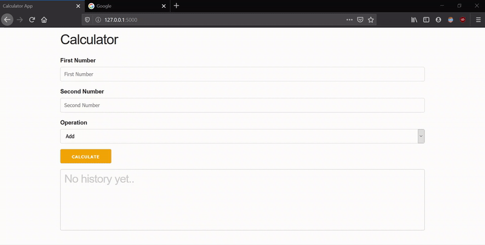

# Calculator API
A calculator API which stores calculations as they happen and shares those calculations with all the users of that API.

## Getting Started
This application has been made using Python Flask and Flask-SocketIO. These are the instructions to get you a copy of the project up and running on your local machine. 

### Prerequisites and Installation
We need to first install pipenv to create a virtual environment with all the project dependencies. 

```bash
 pip install pipenv
```
Now, download the project files and place them in a folder on your local system.

Navigate to that folder and run the below command.
```bash
pipenv install
pipenv shell
```
To run the application
```bash
python app.py
```
To access the application, open browser and hit
```textile
http://127.0.0.1:5000
```

### Application Demo


